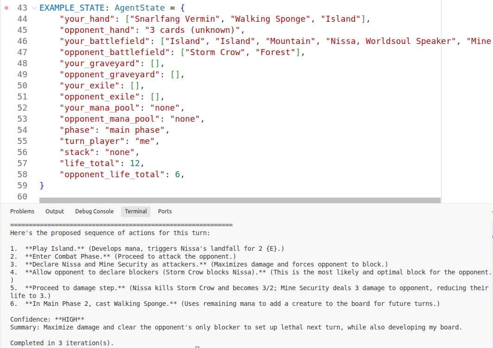

# MTGA Advisor

A Magic: The Gathering Arena advisor using a LangGraph agent loop with exact card data retrieval via Qdrant.

The agent accepts a structured battlefield state, retrieves exact card data, observes the game state, reasons through possible plays, and returns a final recommendation.

## Screenshots



## Project structure

- `main.py` — entrypoint that pre-fetches card data and runs the agent loop
- `agent/state.py` — typed agent state definition with MTG zones
- `agent/nodes.py` — observe / think / act / check node implementations with streaming
- `agent/graph.py` — graph definition and loop wiring
- `agent/prompts.py` — prompt templates for each node
- `tools/rag.py` — exact card data retrieval using Qdrant
- `constants.py` — configuration constants (e.g., MAX_ITERATIONS)
- `AGENTS.md` — detailed project and design documentation

## Architecture

**Agent flow:**

```
observe (once) → think → act → check → (loop back to think if not done) → END
```

- **observe**: Runs once to extract facts from battlefield state and retrieve card data
- **think**: Reasons over observations and card data
- **act**: Proposes concrete actions
- **check**: Decides if recommendation is confident enough or needs another iteration

**Card retrieval:**

- Uses Qdrant vector database with exact name matching (not semantic search)
- Cards are pre-fetched before the agent loop runs
- Single query retrieves all cards at once using "should" filter

**Streaming:**

- LLM responses stream token-by-token for immediate feedback
- Only observe output and final recommendation are printed

## Setup

1. Create a Python environment.
2. Install dependencies:

```bash
pip install -r requirements.txt
```

3. Add your API keys to a `.env` file:

```bash
MODEL_API_KEY=your_model_api_key
QDRANT_URL=your_qdrant_url
QDRANT_API_KEY=your_qdrant_api_key
MODEL_NAME=your_model_name
```

## Run

```bash
python main.py
```

## Configuration

Edit `constants.py` to adjust:

- `MAX_ITERATIONS`: Maximum number of think-act-check loops (default: 3)

## Notes

- State uses lists for card zones (hand, battlefield, graveyard, exile)
- Card data is retrieved via exact name matching, not semantic search
- The agent is optimized for structured MTG game states with known card names
